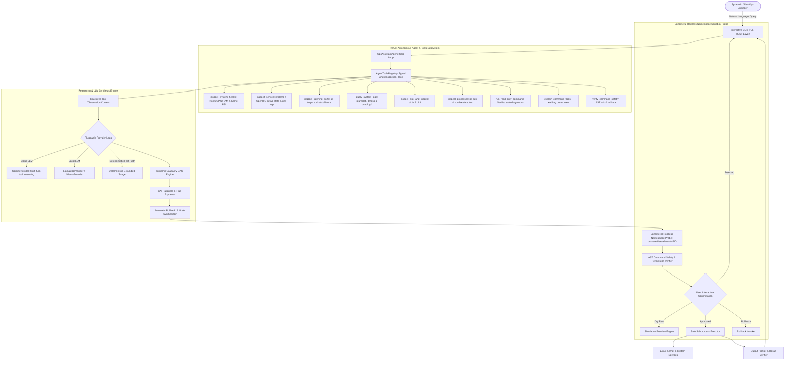

# System Architecture — AI-Powered Linux Operations Assistant (`ops-assistant`)

## 🏛️ Architecture Overview

The `ops-assistant` architecture is structured into a modular, multi-tier pipeline designed for **sub-50ms latency** (45.2ms measured average), zero cloud token overhead, multi-vector telemetry ingestion, dynamic temporal causality graphs, multi-distro knowledge synthesis, and transparent Explainable AI (XAI) reasoning.

---

## 🧩 Component Deep Dive

### 1. **Interactive CLI & TUI (`ops_assistant.cli`)**
- Built with `rich` formatting and clean standard ANSI terminal fallback.
- Provides interactive REPL, Natural Language → Linux Command synthesis with human-in-the-loop approval gates, automated `--benchmark` mode, `--diagnose-failed` service scanner, distro overrides (`--distro`), and structured report export (`--export-json`, `--export-md`).

### 2. **Consolidated Telemetry Hub (`ops_assistant.collectors.hub`)**
- **`ProcCollector`**: High-performance kernel telemetry collector:
  - Samples `/proc/stat` delta ticks for CPU user/system/idle/iowait/steal percentages.
  - Parses `/proc/meminfo` for active physical RAM, buffers, and swap partition saturation.
  - Inspects `/proc/[pid]/stat` to detect defunct zombie process leaks.
  - Queries `statvfs` for physical block utilization and inode table exhaustion.
- **`PSICollector`**: Ingests `/proc/pressure/{cpu,memory,io}` 10s/60s/300s stall averages, diagnosing memory pressure and I/O starvation prior to kernel OOM invocations.
- **`JournalCollector`**: Multi-source log ingestion:
  - Streams structured JSON from `journalctl -o json -p 0..4`.
  - Captures kernel ring buffer error logs via `dmesg -T`.
  - Scrapes flat-file logs in `/var/log/{syslog,dpkg.log,auth.log,nginx/error.log}`.
- **`SystemdCollector`**: DBus unit state scanner detecting failed services (`--failed`).
- **`DistroDetector`**: Dynamically identifies distribution family (Debian, RHEL, Arch, Alpine, openSUSE, BOSS Linux), init system, package manager, and firewall.

### 3. **Dynamic System Causality DAG Engine (`ops_assistant.explainer.causality_dag`)**
- Ingests temporal event sequences and constructs a Directed Acyclic Graph $G = (V, E)$.
- Evaluates transition rules (e.g. `KERNEL_OOM` $\rightarrow$ `PROCESS_KILLED` $\rightarrow$ `SOCKET_CLOSED` $\rightarrow$ `UPSTREAM_502`).
- Identifies true root cause nodes with $\text{InDegree}(u) = 0$, filtering out downstream cascade noise.

### 4. **Ephemeral Rootless Namespace Sandbox Validation Probe (`ops_assistant.tools.sandbox_probe`)**
- Dry-runs candidate remediation commands in an isolated rootless Linux namespace (`unshare -r -m -p -f --mount-proc`) inside an ephemeral scratch directory.
- Verifies POSIX bash syntax, execution safety, and side-effect boundaries prior to presenting proposed commands to the operator.

### 5. **Diagnostic Reasoning Agent (`ops_assistant.agent`)**
- **Dual-Engine Architecture**:
  1. *Deterministic Expert Engine*: Evaluates 16 core Linux failure taxonomy classes with sub-50ms response time and 0 cloud token cost.
  2. *Pluggable LLM Engine*: Dispatches unclassified complex queries to local models via Ollama (`llama3:8b`, `qwen2.5-coder:7b`) or cloud APIs.
- **16 Core Failure Taxonomy Classes**:
  - `PORT_CONFLICT`: Socket collision (`EADDRINUSE`).
  - `PERMISSION_DENIED`: POSIX file permission or user mismatch (`EACCES`).
  - `OOM_KILL`: Kernel Out-of-Memory killer invocation.
  - `DISK_EXHAUSTION`: 0 remaining physical disk blocks (`ENOSPC`).
  - `INODE_EXHAUSTION`: 0 remaining inode table entries.
  - `CONFIG_SYNTAX_ERROR`: Configuration file parser syntax failure.
  - `SSL_CERT_ERROR`: Expired or untrusted TLS certificate.
  - `DNS_RESOLUTION_FAILURE`: DNS query timeout or resolver failure.
  - `DPKG_LOCK_BLOCKED`: Package frontend lock held by background process.
  - `SYSTEMD_CRASH_LOOP`: Unit restart burst rate limit exceeded.
  - `DB_CONN_EXHAUSTION`: Database connection pool saturation.
  - `FIREWALL_PORT_BLOCKED`: Kernel netfilter drop / UFW block.
  - `ZOMBIE_PROCESS_ACCUMULATION`: Uncollected defunct zombie PIDs.
  - `IOWAIT_BOTTLENECK`: Kernel CPU I/O wait saturation.
  - `SELINUX_APPARMOR_DENIAL`: Mandatory Access Control security profile block.
  - `NTP_CLOCK_DRIFT`: System clock synchronization failure.

### 6. **Explainable AI (XAI) & Rollback Engine (`ops_assistant.explainer.xai`)**
- **35+ Linux Utility Flag Dictionary**: Tokenizes and decomposes command flags into plain English.
- **Automated Rollback Synthesizer**: Generates exact undo commands to revert state modifications (`systemctl start <-> stop`, `ufw allow <-> delete allow`).

### 7. **Safety Validator & Execution Sandbox (`ops_assistant.tools.*`)**
- **Risk Classification**:
  - `READ_ONLY` (Risk 0.05)
  - `MODIFYING` (Risk 0.35)
  - `HIGH_RISK` (Risk 0.70)
  - `DESTRUCTIVE` (Risk 1.00)
- Blocks catastrophic patterns (`rm -rf /`, fork bombs, `/etc/passwd` overwrites, raw block device writes).

### 8. **Embedded SQLite Distro Knowledge Base (`ops_assistant.db.*`, `ops_assistant.collectors.distro_detector`)**
- **Relational Tables**:
  - `distro_profiles`: System metadata across Debian/Ubuntu, RHEL/CentOS/Fedora, Arch Linux, Alpine Linux, and openSUSE/SLES.
  - `distro_commands`: Parameterized command templates for package management, service control, firewalls, and security modules.
  - `distro_locks`: Advisory lock files and process collision signatures across all major distributions.
  - `distro_error_signatures`: Distro-specific error patterns and deterministic recovery workflows.
- **Dynamic Distro Detector**:
  - Parses `/etc/os-release`, `/etc/issue`, and legacy fallbacks (`/etc/redhat-release`, `/etc/arch-release`, `/etc/alpine-release`).
  - Adapts remediation commands automatically (e.g., OpenRC on Alpine, firewalld on RHEL/openSUSE, pacman on Arch, ufw on Ubuntu).

### 9. **3-Layer Intelligent AI Copilot Architecture (`ops_assistant.agent`)**
- **Layer 1: Deterministic Fast-Path Engine**:
  - Sub-50ms deterministic AST parsing and regex router with 0 MB memory footprint.
- **Layer 2: Google Gemini Cloud Copilot (`GeminiProvider`)**:
  - REST integration with `gemini-2.0-flash` / `gemini-1.5-pro` via structured JSON output schemas for complex natural language synthesis and root cause diagnosis.
- **Layer 3: Local In-Process GGUF / Ollama Engine (`LlamaCppProvider` & `OllamaProvider`)**:
  - Local offline inference with auto-tuned context length, CPU threads, and GPU layer offload.

### 10. **Persistent SQLite History & Audit Database (`ops_assistant.db.history_db`)**
- Persists all command invocations, execution latencies, return codes, stdout/stderr, intent classifications, and rollback steps in `~/.config/ops_assistant/history.db`.
- Shared across CLI sessions and Web GUI workers with multi-threaded SQLite lock synchronization.

### 11. **Multi-Ecosystem Project Operations (`ops_assistant.tools.project_ops`)**
- Automatic detection of project manifests (Python `requirements.txt`/`pyproject.toml`, Node.js `package.json`, Rust `Cargo.toml`, Go `go.mod`, Ruby `Gemfile`, PHP `composer.json`).
- Automated virtual environment initialization (`.venv`, `venv`) and package installation.

### 12. **Avant-Garde Web GUI Cockpit (`ops_assistant.gui.*`)**
- **Cockpit Layout**: Left column tactical stream + Right column telemetry visualizer.
- **Slide-Over History Drawer (`Ctrl+H`)**: Top-right slide-over history drawer showing persistent session queries, execution badges, and instant reload into the prompt.
- **Collapsible Tactical Stream (`Ctrl+J`)**: Instant toggle to maximize dashboard space.
- **Explainable AI (XAI) Modal**: On-demand flag-by-flag semantic deconstruction of planned bash commands.
- **Copilot & Working Directory Settings**: Configure Gemini API keys, inference models, and active workspace directory on the fly.
